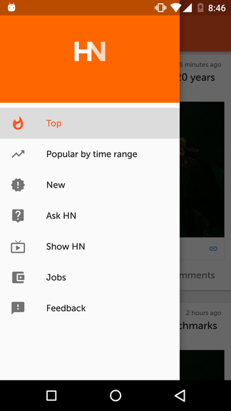
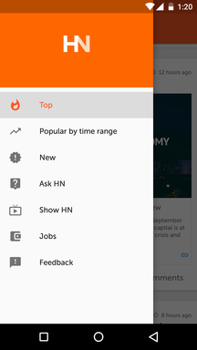
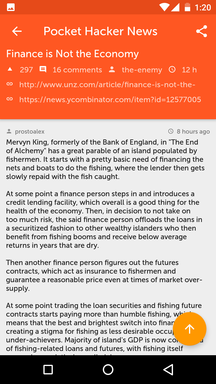

### PocketHackerNews

A realtime Hacker News client built on official [Hacker News's API](https://github.com/HackerNews/API)
Copyright (C) 2016 Sahil Shekhawat <sahilshekhawat01@gmail.com>

This program is free software: you can redistribute it and/or modify
it under the terms of the GNU General Public License as published by
the Free Software Foundation, either version 3 of the License, or
(at your option) any later version.

This program is distributed in the hope that it will be useful,
but WITHOUT ANY WARRANTY; without even the implied warranty of
MERCHANTABILITY or FITNESS FOR A PARTICULAR PURPOSE.  See the
GNU General Public License for more details.

You should have received a copy of the GNU General Public License
along with this program.  If not, see <http://www.gnu.org/licenses/>.

### Screenshots
 Stories                   |  Navigation bar
:-------------------------:|:-------------------------:
  |  

 Particular Story          |  WebView
:-------------------------:|:-------------------------:
  |  
